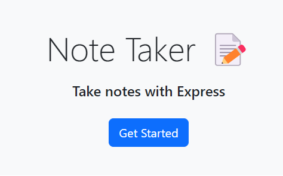

<!-- Improved compatibility of back to top link: See: https://github.com/othneildrew/Best-README-Template/pull/73 -->

<!--
*** Thanks for checking out the Best-README-Template. If you have a suggestion
*** that would make this better, please fork the repo and create a pull request
*** or simply open an issue with the tag "enhancement".
*** Don't forget to give the project a star!
*** Thanks again! Now go create something AMAZING! :D
-->

<!-- PROJECT SHIELDS -->
<!--
*** I'm using markdown "reference style" links for readability.
*** Reference links are enclosed in brackets [ ] instead of parentheses ( ).
*** See the bottom of this document for the declaration of the reference variables
*** for contributors-url, forks-url, etc. This is an optional, concise syntax you may use.
*** https://www.markdownguide.org/basic-syntax/#reference-style-links
-->
[![Contributors][contributors-shield]][contributors-url]
![Languages][top-lang-shield]
![Commits][commits-shield]
[![Issues][issues-shield]][issues-url]
[![MIT License][license-shield]][license-url]
[![LinkedIn][linkedin-shield]][linkedin-url]

<!-- PROJECT LOGO -->
 

  

<h1 align="center">Note Taker</h1>

  

    A note taking application utilizing express.js for the backend functionality
  

<!-- TABLE OF CONTENTS -->

  
Table of Contents

  <ol>
    <li><a href="#about-the-project">About The Project</a></li>
    <li><a href="#installation">Installation</a></li>
    <li><a href="#usage">Usage</a></li>
    <li><a href="#contributing">Contributing</a></li>
    <li><a href="#license">License</a></li>
    <li><a href="#contact">Contact</a></li>
  </ol>

<!-- ABOUT THE PROJECT -->
## About The Project

A simple web app to write and save notes remotely using Express.js, a fast, unopinionated, minimalist web framework for Node.js. This web app has been deployed using Heroku.  

Visit the deployed site to use this apllication from anywhere!

(<a href="#readme-top">back to top</a>)

## Installation

N/A

(<a href="#readme-top">back to top</a>)

<!-- USAGE EXAMPLES -->
## Usage

To use this application, just click the 'Get Started' button on the home page. You'll be redirected to the main application page where you can type up a note and hit save. The note will be written to the 'database' where it will be stored. After that the note can be viewed or deleted at any time.

(<a href="#readme-top">back to top</a>)

<!-- CONTRIBUTING -->
## Contributing

N/A

(<a href="#readme-top">back to top</a>)

<!-- LICENSE -->
## License

Distributed under the MIT License. See `LICENSE.txt` for more information.

(<a href="#readme-top">back to top</a>)

<!-- CONTACT -->
## Contact

Jared Morrison -  jmorrison.m44@gmail.com

Project Link: [https://github.com/jradmorrison/note-taker](https://github.com/jradmorrison/note-taker)

(<a href="#readme-top">back to top</a>)

<!-- MARKDOWN LINKS & IMAGES -->
<!-- https://www.markdownguide.org/basic-syntax/#reference-style-links -->
[contributors-shield]: https://img.shields.io/github/contributors/jradmorrison/note-taker.svg?style=for-the-badge
[contributors-url]: https://github.com/jradmorrison/note-taker/graphs/contributors
[forks-shield]: https://img.shields.io/github/forks/jradmorrison/note-taker.svg?style=for-the-badge
[forks-url]: https://github.com/jradmorrison/note-taker/network/members
[stars-shield]: https://img.shields.io/github/stars/jradmorrison/note-taker.svg?style=for-the-badge
[stars-url]: https://github.com/jradmorrison/note-taker/stargazers
[issues-shield]: https://img.shields.io/github/issues/jradmorrison/note-taker.svg?style=for-the-badge
[issues-url]: https://github.com/jradmorrison/note-taker/issues
[license-shield]: https://img.shields.io/github/license/jradmorrison/note-taker.svg?style=for-the-badge
[license-url]: https://github.com/jradmorrison/note-taker/blob/master/LICENSE.txt
[linkedin-shield]: https://img.shields.io/badge/-LinkedIn-black.svg?style=for-the-badge&logo=linkedin&colorB=555
[linkedin-url]: https://linkedin.com/in/jradmorrison
[product-screenshot]: images/screenshot.png
[Next.js]: https://img.shields.io/badge/next.js-000000?style=for-the-badge&logo=nextdotjs&logoColor=white
[Next-url]: https://nextjs.org/
[React.js]: https://img.shields.io/badge/React-20232A?style=for-the-badge&logo=react&logoColor=61DAFB
[React-url]: https://reactjs.org/
[Vue.js]: https://img.shields.io/badge/Vue.js-35495E?style=for-the-badge&logo=vuedotjs&logoColor=4FC08D
[Vue-url]: https://vuejs.org/
[Angular.io]: https://img.shields.io/badge/Angular-DD0031?style=for-the-badge&logo=angular&logoColor=white
[Angular-url]: https://angular.io/
[Svelte.dev]: https://img.shields.io/badge/Svelte-4A4A55?style=for-the-badge&logo=svelte&logoColor=FF3E00
[Svelte-url]: https://svelte.dev/
[Laravel.com]: https://img.shields.io/badge/Laravel-FF2D20?style=for-the-badge&logo=laravel&logoColor=white
[Laravel-url]: https://laravel.com
[Bootstrap.com]: https://img.shields.io/badge/Bootstrap-563D7C?style=for-the-badge&logo=bootstrap&logoColor=white
[Bootstrap-url]: https://getbootstrap.com
[JQuery.com]: https://img.shields.io/badge/jQuery-0769AD?style=for-the-badge&logo=jquery&logoColor=white
[JQuery-url]: https://jquery.com 
[top-lang-shield]: https://img.shields.io/github/languages/top/jradmorrison/note-taker.svg?style=for-the-badge
[commits-shield]: https://img.shields.io/github/commit-activity/t/jradmorrison/note-taker.svg?style=for-the-badge